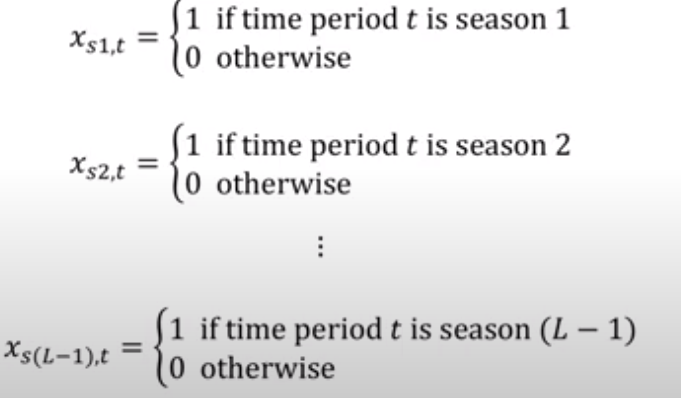
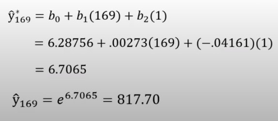

# 성은([vg-rlo](https://github.com/vg-rlo))

## Growth Curve Models 수식에서 log 변환을 취해줌으로써 모델링할 수 있어진다는 점이 식의 구성?에서의 선형조건이 성립된 것인지 궁금합니다. 

# 이삭([IsaacTips](https://github.com/IsaacTips))
## Seasonal Factor를 Binary 변수로 바꿔주는 이유?

Binary 변수로 바꿔주는 것을 하나의 표현 방식이라고 생각하자.

t시점에서 season이 일치하다면 1이고 아니면 0으로 표현. 

예시를 보면 169는 8년째의 1월이기 때문에 $x_{1}$에 169, $x_{2}$에 1을 넣고 나머지는 전부 0이 된다. 

__결론__
* Binary 변수로 바꿔주는 것은 하나의 표현 방식인데, t 시점이 그 season이라면 1을 아니면 0으로 표현하여, 예측모델 수식에 넣는다.

# 인유([willowlkim8](https://github.com/willowkim8))

- 이진 변수

------

계절적 변동(호텔 투숙객 변화량) →  seasonal variation 을 이진변수로 어떻게 모델링 할지

$$M_1 = { 1, 0} :1월or 비1월
 $$

$$M_2= { 1, 0} :2월or 비2월$$

$$M_{11} 까지만 있다.$$

$M_{11}$까지만 있다.  M_1 ~ M_11 까지 모두 0일때 12월이니까

linear trend

log transform 으로 increasing variation 을 constant variation  으로 변경 후  이진변수 모델을 적용해야한다.

다음 1월 예측 계산

- Trigonometric Models

------

sin과 cos으로 seasonal variation을 표현해보면 어떨까

model 1 → 조금 regular 한거,  simple seasonal 에서

model 2 → more complicated seasonal patterns은 이걸로

model 1 → 베타 0부터 3까지 추정하면 된다.

해석보다 예측에 더 많이 쓰이는 모델이다.

- Growth Curve Model (성장커브)

------

파라미터가 linear하지 않을 때

t시점에서  y를 파라미터의 비선형 결합으로 알아보자

더하기 빼기가 아니고 곱하기로 이루어져있음

비선형은 모델링이 어려워서 이걸 다시 Linear 파라미터로 바꿔줘야 함

로그 성질을 이용 곱하기를 → 더하기로 : 선형식으로 바꿔줌

- Time Series Regression with Autocorrelation

------

Original regression 가정의 일부를 코릴레이션이 있다는 걸 감안해서

→ error term이 Autocorrelation 되어있다는 가정 하에

# 민정([miinkang](https://github.com/miinkang))
## 삼각함수를 이용한 시계열 데이터 예측 
*강의 중 해당 내용에 대해 더 찾아본 후 정리하였습니다.*    

- 데이터가 갖고 있는 반복적인 패턴을 모델링하기 위해 사용되는 기법. 
- 데이터의 계절성을 민감하게 반영할 경우 overfitting문제가 발생할 수 있다. 
- 이를 해결하기 위해 sin, cos을 이용해 smoothing시킨다.    
- sin, cos 두 패턴 중 어떤 패턴이 해당 데이터에 적합한 지 눈으로 파악할 수 없기 때문에, 모두 공식에 넣어 **통계적으로 유의미한 것**을 사용한다.    
ref. [삼각함수를 이용한 시계열 예측](https://blog.naver.com/PostView.nhn?blogId=ibuyworld&logNo=222021695385&parentCategoryNo=&categoryNo=&viewDate=&isShowPopularPosts=false&from=postView)